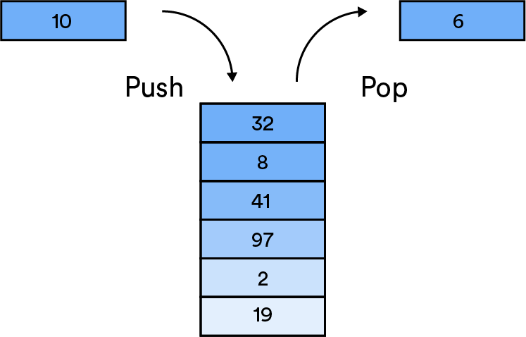
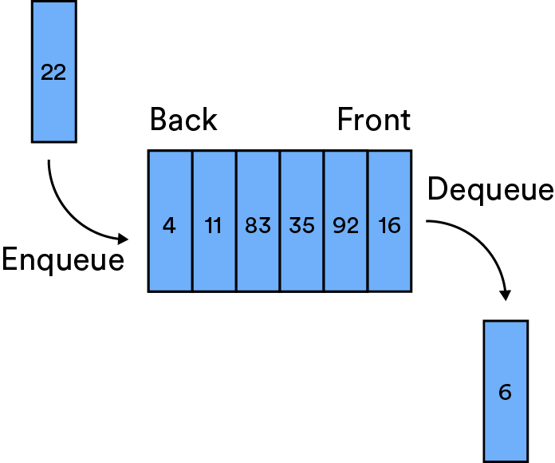
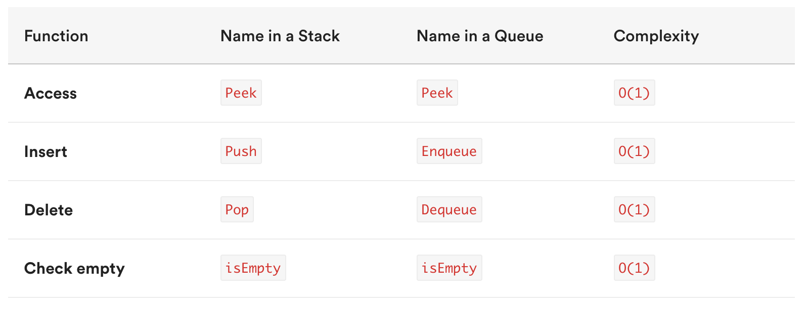

#  SOFTWARE ENGINEERING IMMERSIVE

## Data Structures Cont'd: Stacks & Queues

### Objectives

By the end of this lesson and exercise, you should be able to:

1. Define and differentiate stacks versus queues.
2. Understand scenarios in which one is more advantageous than the other.

<br>

### Introducing Stacks & Queues

What _are_ stacks and queues?

<details><summary>Reveal Answer</summary>

- Collections of data which are defined by their behavior of adding or removing data.

</details>

#### Stacks


Stacks operate on **LIFO** – last in, first out. The most recently added item will be the first to be removed.



Of course, you've worked with and observed stacks already. Can you name some example?

<details><summary>Reveal Answer</summary>

- Internet browser history
- The "undo" action (Command + Z)
- The function call stack

</details>


[VisuAlgo](https://visualgo.net/en/list)


### Queues


Queues operate on **FIFO** – first in, first out. The items are removed from the queue in the order they were added, from first to last.



You also have worked with Queues– can you name some?

<details><summary>Reveal Answer</summary>

- Printer job queues
- CPU scheduling

</details>

[VisuAlgo](https://visualgo.net/en/list)

<br>

### Efficiency

Of course, with an incredibly limited set of operations, you can get impressive efficiency with stacks and queues:



<br>


## What is a stack?
A Stack is a Last In First Out (LIFO) data structure. 

Imagine you have a bunch of plates stacked in the sink... When it comes time to clean those plates you have to pick up from the top.

## When would we use a stack?
- During function calls because it follows a LIFO structure
- Undo / Redo
- Routing (the history object) is treated like a stack!
- Stack is used in some scheduling algorithms.


### We already use it...
We can use an array to create a stack and use the inbuilt JS methods to effect it.

- use `push()` & `pop()`
to add and remove form the end of the array.
- Use `unshift()` & `shift()` to add and remove from the beggining. 
- The caveat is that we're having to re index every item everytime we use `shift()` & `unshift()`

Define a class called stack 

```
class Stack {
    constructor() {
        this.first = null;
        this.last = null;
        this.size = 0;
    }
}

class Node {
    constructor() {
        this.value = value;
        this.next = null;
    }
}
```

## Pseudocode

### Push
- The function should accept a value
- Create a new node with that value
- If there are no nodes in the stack, set the first and last property to be the newly created node
- If there is at least one node, create a variable that stores the current first property on the stack.
- Reset the first property to be the newly created node
- Set the next property on the node to be the previously created varaiable
- Increment the size of the stack by 1

### Pop
- If there are no nodes in the stack, return null
- Create a temporary variable to store the first property on the stack.
- If there is only 1 node, set the first and the last property to be null
- If there is more than one node, set the first property to be the next property on the current first
- Decrement the size by 1
- Return the value of the node removed


There is no inbuilt Stack method in JS.. In some other languages there are. That's why it's important to know.

## Queue
This is a FIFO data structure!
- Works as you would imagine it does.

We have an enqueue and a dequeue method. With Stacks we add to the end & remove from the beggining.

### Dequeue pseudocode
- If there is no first property, just return null
- Store the first property in a variable
- See if the first is the same as the last (check if there is only 1 node). If so, set the first and last to be null.
- If there is more than 1 node, set the first property to be the next property of first
- Decrement the size by 1
- Return the value of the node dequeued


### Recap on Queues
- Constant time!
- FIFO data structure, all elements are first in first out.
- Useful for processing tasks and are foundational for more complex data structures.


### Bonus exercise!

Fork and clone this repo and follow the instructions in `bracketMatcher.md`.

