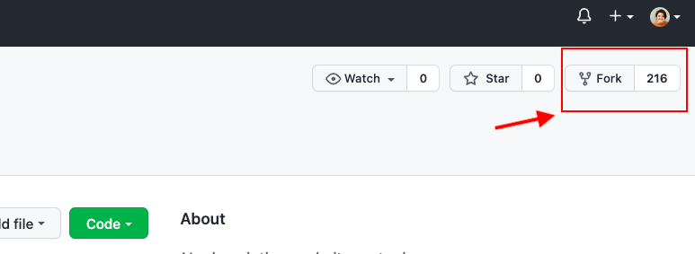
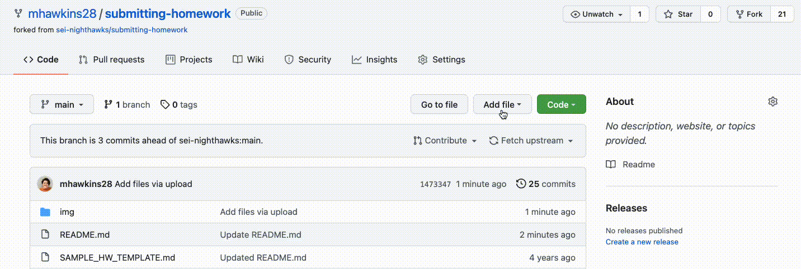
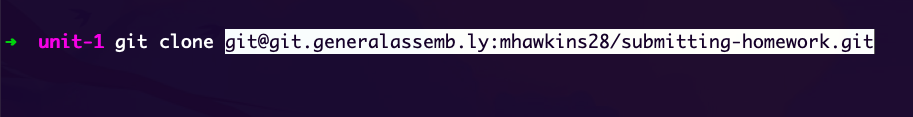

#   SOFTWARE ENGINEERING IMMERSIVE

# Homework Submission Guidelines
    
<br>

1. Click on the fork button in the top right corner - MAKE SURE YOU DO THIS STEP FIRST

    
      
    * This will take a second (but will give you a nice loading screen)
    * Once the repo is forked, notice that you have a new repo under your account, forked from sei-nyc-seb/submitting-homework
    
    


2. Click the **code** button to copy the URL (use the SSH option if you set this up)

    
    
    <br>
    
3. Paste the URL for **your repo** into terminal after the command `git clone`
 
    

    -  Run the command: `git clone URL` -- a new copy of the repo will be created in your current working directory.
    

    ```bash
    git clone https://git.generalassemb.ly/your-account-name/name-of-the-repo.git
    ```

<br>

4. `cd` into the cloned repository

    ```bash
    cd name-of-directory
    ```
<br>

5. Open your directory in the editor and make some changes to a file
   ```bash
    code .
    ```
<br>

6. Check your remote. 
    ```bash
    git remote -v
    ```
    If you forked correctly your remote should look like this

    ```
    origin	https://git.generalassemb.ly/your-account-name/name-of-the-repo.git (fetch)
    origin	https://git.generalassemb.ly/your-account-name/name-of-the-repo.git (push)
    ```

<br>

<details><summary>If you didn't fork correctly</summary>

### If you didn't fork correctly, follow these steps.

 1. Fork the repo on Github Enterprise.
 2. Click the clone or download button and copy the clone URL for your repo.
 3. Set the url of your remote from the command line with:
         `git remote set-url origin URL`
         
 4. Add, commit and push your changes.
    
For more information, click [here](https://help.github.com/en/articles/changing-a-remotes-url)

</details>

<br>

7. Add, commit, and push your changes
    ```
    git add .
    git commit -m "fixed the navbar"
    git push origin master
    ```
<br>

8.  Confirm the remote is up to date by either using `git status` or by checking on GitHub that the remote and local histories are the same.


<hr>


## Making the Pull Request

Now that you have pushed new changes to your forked repo, you can create a pull request from your remote repo to the original repo to ask that repo's owners to bring the new commits published to your fork, into their repo:

1. Click the "New pull request" button in the repository !

    

<br>

2. On the compare page you select the repo/branch to and from which you're making the pull request

<br>
   
3. Click **Create pull request**

   

<br>

4. Enter your name for the title and add a description
       
    * In the description, include:
       * a degree of **completeness** between 0 and 3 (required)
       * a level of **comfort level** between 0 and 5 (required)
       * **comments** : win, struggle, questions, comments

    [see homework template](SAMPLE_HW_TEMPLATE.md)

     

<br>

5. Click **Create pull request**

<br>

6. Check that the original repo has a new pull request from you

<br>


Nice work! Take a moment to think about this flow because we'll be using it throughout the course!

* Note: A pull request creates an association between the two branches to the commits at that point in time. That means that if you push more changes to GitHub before the pull request is merged or closed, those changes will also be included in the PR.

* GitHub provides a lot of features for communicating around pull requests. The most fundamental is commenting. GitHub provides not only the mechanism to share code but also the forum to discuss that code. 

* Being clear and concise in discussing code in text (on GitHub but also more generally in text) is an invaluable skill. It takes practice and is especially frustrating while developing a new technical vocabulary but effort here pays dividends.

* The more clearly and concisely you can describe a problem, the more effectively and happily other developers will help you.

## Resources

- [GitHub Guides: Forking](https://guides.github.com/activities/forking/)
- [GitHub Bootcamp: Fork a Repo](https://help.github.com/articles/fork-a-repo/)
- [GitHub: About Pull Requests](https://help.github.com/articles/about-pull-requests/)
- [Interactive Git Cheatsheet](http://ndpsoftware.com/git-cheatsheet.html)
- [What makes a great commit message?](https://tbaggery.com/2008/04/19/a-note-about-git-commit-messages.html)
