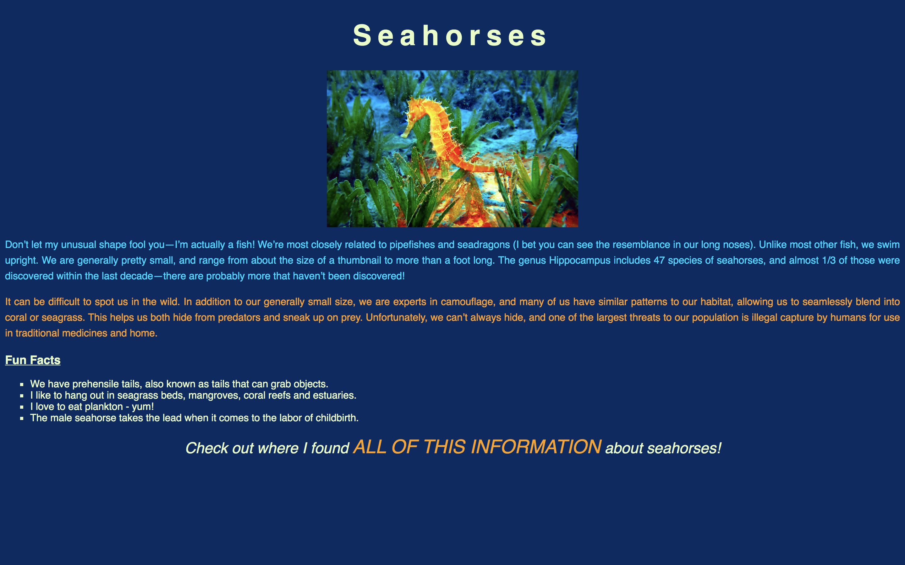
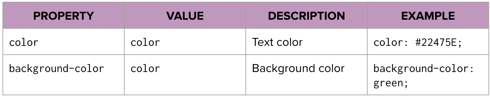
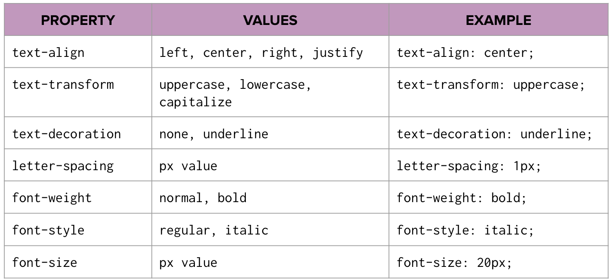
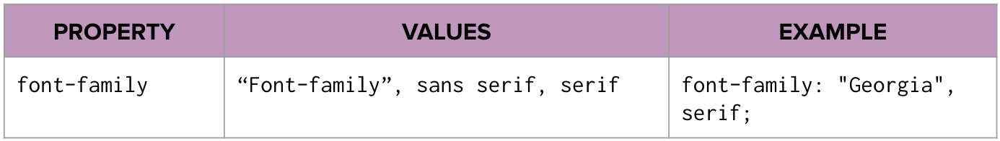

# Typography Practice - Lab

## Intro
The following lab provides practice using html and basic css to re-create a page that resembles the mock image that is provided.

## Setup and Instructions 

1.  Fork and clone this repository.
2.  Open the HTML document in your browser.
3.  The starter code is in the `index.html` and `style.css` files. Using those files, complete the exercise listed below.

## Exercise

The goal is to create a replica of the image above. The HTML boilerplate and content have been provided for you, as well as a CSS typography cheat sheet (below). If you get stuck or come across a style that isn't listed, try doing some research (Google!) to find the solution. You're a developer after all - let's see what you can do!

1. Link the stylesheet to the HTML document. Be sure you make sure they are linked before you move on!
2. Update `style.css` to make your web page look as close as possible to the example image. We won't be checking for exact fonts or color codes, but use the tools you have (like Digital Color Meter and what you know about fallbacks for the font family property) to choose styles that are similar.

## Bonus

1. Try importing a Google Font and changing the style for your header elements to what you have selected.
2. Center the image! This isn't something we have covered in class YET, but see if you can find out what CSS declarations will accomplish the task!

## Deliverable

**This lab is a deliverable.** Please submit your pull request once completed.

